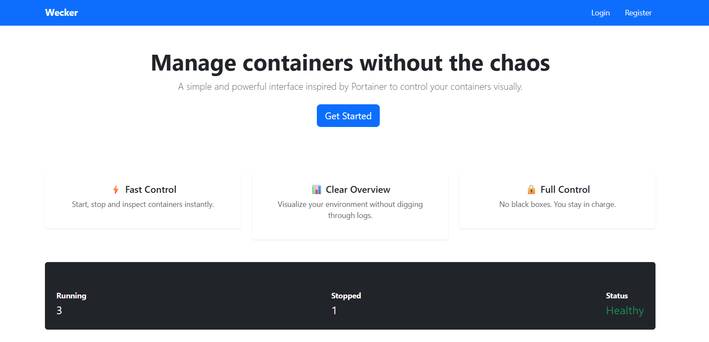
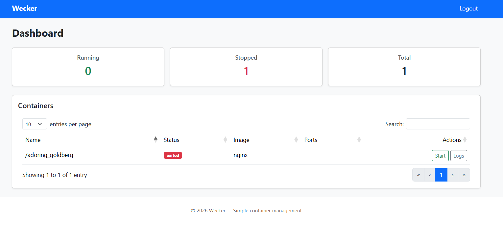

# Wecker
**A simple and powerful interface inspired by Portainer to control your containers visually.**

Note: Requires Docker Desktop on Windows/macOS.

# Setup Env
1. Install docker.
    1. On windows you need to activate WSL2 and enable "Expose daemon on tcp://localhost:2375 without TLS" option.
2. Run ./run.sh setup
3. Run ./run.sh up
4. Configure the postgresql database with user/login equals to root.
5. Run database.sql script into database.

# Pending to Fix
- Implement tests.
- Implement BlockUI

# Future Implements
- Health Status.
- Docker installation info.
- Web console to manage containers.
- Log Operations (Start, Stop, Log).
- Create containers.
- Real time docker logs.
- Improve UI and UX.